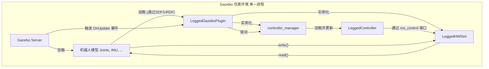

# `legged_gazebo` 包代码分析

## 1. 功能与节点关系

### 1.1. 核心功能

`legged_gazebo` 包是整个控制系统在 **Gazebo 仿真环境**中的硬件抽象层实现。它的核心是一个 **Gazebo 插件**，当在仿真中运行机器人时，这个插件会替代与真实硬件通信的 `legged_hw` 节点。

其核心功能可以概括为：

1.  **模拟硬件接口**: 插件内部创建了一个 `LeggedHWSim` 对象，该对象模拟了 `legged_hw` 包中的 `LeggedHW` 类的功能。它实现了 `legged_common` 中定义的 `HybridJointInterface` 等接口，但其数据的来源和指令的目标是 Gazebo 的仿真模型，而非物理硬件。
2.  **集成 `ros_control`**: 插件在 Gazebo 的仿真环境中加载并运行了 `controller_manager`。这使得上层的 `LeggedController` 可以在 Gazebo 中被加载和运行，就像在真实机器人上一样。
3.  **驱动仿真控制循环**: 插件将其核心更新逻辑绑定到 Gazebo 的世界更新事件上。这意味着 Gazebo 的每个仿真步进都会驱动一次 `read()` -> `update()` -> `write()` 的完整控制流程，从而使机器人在仿真世界中动起来。

简而言之，`legged_gazebo` 包通过一个 Gazebo 插件，完美地“欺骗”了上层 `ros_control` 系统，让它以为自己正在与一个真实的机器人硬件交互，从而实现了仿真与现实之间的高度一致性。

### 1.2. 节点关系

在仿真环境中，没有 `legged_hw_node` 这个独立的ROS节点。它的功能被完全整合进了 Gazebo 插件中，并在 Gazebo 的进程内运行。

**关系说明**:

-   当 Gazebo 启动并加载机器人模型时，模型描述文件（SDF/URDF）中指定的 `LeggedGazeboPlugin` 会被一并加载。
-   插件的 `Load()` 方法被调用，它会创建 `LeggedHWSim`（仿真版硬件抽象层）和 `controller_manager` 的实例。
-   插件将自己的 `OnUpdate()` 方法注册为 Gazebo 世界更新的回调函数。
-   在每个仿真周期，Gazebo 调用 `OnUpdate()`，该函数内部会依次执行 `LeggedHWSim::read()`、`controller_manager::update()` 和 `LeggedHWSim::write()`。
-   `read()` 从 Gazebo 的模型API获取关节角度、速度等信息。
-   `update()` 触发 `LeggedController` 的计算。
-   `write()` 将 `LeggedController` 计算出的最终力矩通过 Gazebo 的API施加到模型的关节上。

---

## 2. 各个节点类中各个方法的功能

### 2.1. `LeggedGazeboPlugin` (Gazebo 插件类)

-   `void Load(gazebo::physics::ModelPtr parent, sdf::ElementPtr sdf)`
    -   **功能**: **插件入口点**。当 Gazebo 加载机器人模型时，此函数被自动调用。
        1.  从 Gazebo 获取模型指针 (`parent`) 和SDF/URDF中的插件参数。
        2.  **实例化 `LeggedHWSim`**: 创建一个 `LeggedHWSim` 对象，并将 Gazebo 的模型指针传递给它，以便 `LeggedHWSim` 可以访问仿真模型的关节和传感器。
        3.  **实例化 `controller_manager`**: 创建一个 `controller_manager` 对象，并将其与 `LeggedHWSim` 关联。
        4.  **绑定更新事件**: 将 `OnUpdate` 方法绑定到 Gazebo 的世界更新事件连接上。

-   `void OnUpdate(const gazebo::common::UpdateInfo& info)`
    -   **功能**: **仿真控制循环**。在每个仿真时间步被 Gazebo 调用。
        1.  计算当前时间和周期。
        2.  调用 `leggedHWSim_->read()` 从 Gazebo 模型读取状态。
        3.  调用 `controllerManager_->update()` 触发 `LeggedController` 的计算。
        4.  调用 `leggedHWSim_->write()` 将计算出的力矩施加到 Gazebo 模型上。

### 2.2. `LeggedHWSim` (仿真硬件抽象类)

这个类通常在 `legged_hw` 包中与 `LeggedHW` 一起定义，或者在 `legged_gazebo` 中定义，但其接口与 `LeggedHW` 完全一致。

-   `bool init(...)`
    -   **功能**: 初始化。与 `LeggedHW` 类似，它也负责注册所有硬件接口句柄。但它不建立与物理硬件的通信，而是从传入的 Gazebo 模型指针中获取指向各个关节、IMU传感器等的指针。

-   `void read(...)`
    -   **功能**: **从Gazebo读取数据**。它调用 Gazebo API 来获取每个仿真关节的 `GetPosition()`、`GetVelocity()`，获取IMU传感器的 `AngularVelocity()`、`LinearAcceleration()` 等，并用这些值更新接口句柄中的状态变量。

-   `void write(...)`
    -   **功能**: **向Gazebo写入指令**。它从 `HybridJointHandle` 中获取上层控制器计算出的期望值，计算出最终的目标力矩，然后调用 Gazebo 关节对象的 `SetForce()` 或 `SetTorque()` 方法，将力矩施加到仿真模型上。

---

## 3. 其他需要说明的内容

-   **无缝切换**: `legged_gazebo` 包的存在使得整个控制代码库实现了仿真和现实的无缝切换。对于上层开发者来说，他们只需要关心 `LeggedController` 的逻辑，而无需关心底层是与 Gazebo 插件通信还是与真实的硬件驱动通信。切换运行环境通常只需要在顶层的 `launch` 文件中更改一个参数即可。
-   **Gazebo 插件 vs. ROS 节点**: 理解插件和节点的区别很重要。`legged_hw_node` 是一个独立的ROS进程，它通过ROS消息与系统的其他部分通信。而 `LeggedGazeboPlugin` 是一个动态链接库（`.so` 文件），它被 Gazebo 服务器进程动态加载并在其内部运行。这种方式通信效率更高（因为在同一进程内），是与仿真器深度集成的标准做法。
-   **仿真模型的准确性**: 仿真结果的有效性高度依赖于URDF/SDF文件中定义的机器人模型的准确性，包括连杆的质量、惯性张量、关节的摩擦和阻尼、以及接触参数等。这些参数需要与真实机器人进行仔细的标定才能获得逼真的仿真效果。
